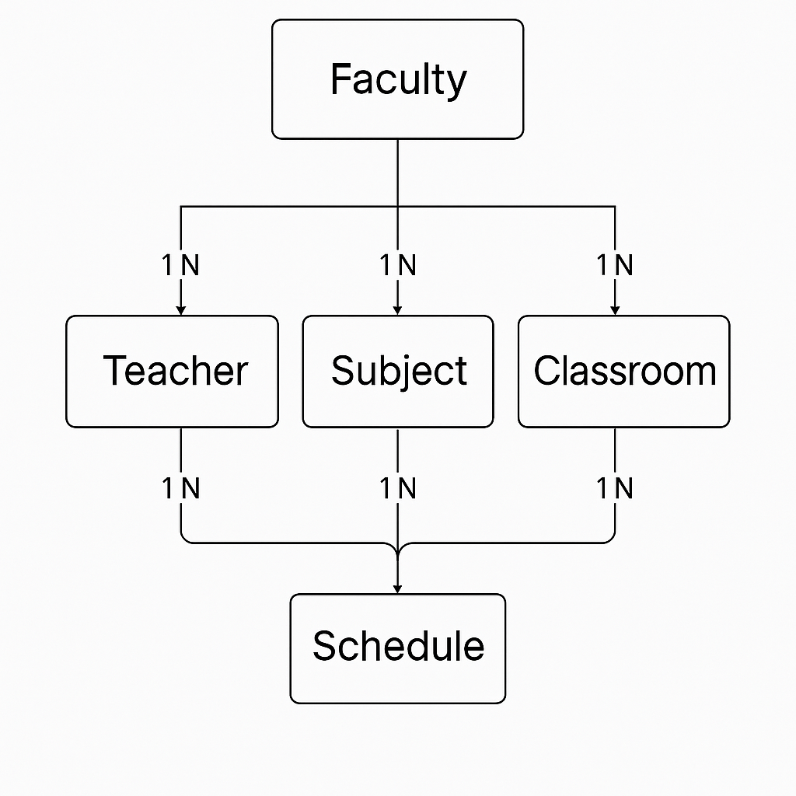

# Organizer API

API modular para administrar la planificación académica de una institución. Permite gestionar facultades, docentes, materias, aulas y horarios usando NestJS, TypeORM y PostgreSQL.



## Características principales

- Gestión completa de las entidades académicas: `Faculty`, `Teacher`, `Subject`, `Classroom` y `Schedule`.
- Relaciona docentes con materias y aulas con horarios, permitiendo filtrar por facultad o docente.
- Validaciones automáticas con `class-validator` y `ValidationPipe` global (whitelist + transformación de tipos).
- Configuración centralizada mediante variables de entorno y `ConfigModule`.
- Paginación en todos los listados (`limit` y `offset`) con valores por defecto configurables.
- Docker Compose para levantar rápidamente la base de datos PostgreSQL en local.

## Stack tecnológico

- Node.js 20+
- NestJS 11 (Framework backend)
- TypeScript 5
- TypeORM 0.3 (ORM)
- PostgreSQL 17
- Jest & Supertest (testing)
- ESLint + Prettier (estilo de código)

## Arquitectura del proyecto

El código se organiza por dominios en módulos independientes dentro de `src/`:

- `faculty`: Facultades y su catálogo.
- `teachers`: Docentes asociados a cada facultad.
- `subjects`: Materias impartidas por docentes y vinculadas a facultades.
- `classroom`: Aulas con capacidad y estado operativo.
- `schedule`: Bloques horarios que combinan aula + materia (y, por transitividad, docente/facultad).
- `common`: Utilidades compartidas (DTOs, adapters, pipes, configuración).
- `seed`: Punto de entrada para sembrar datos (en construcción).

Toda la API expone rutas bajo el prefijo `/api/v1`.

## Requisitos previos

- Node.js 20 o superior
- npm 10 o superior
- Docker

## Configuración local

1. **Instalar dependencias**

   ```bash
   npm install
   ```

2. **Configurar variables de entorno** (crear un archivo `.env` en el raíz del proyecto):

   ```dotenv
   PORT=3000
   NODE_ENV=dev
   DEFAULT_LIMIT=10
   OFFSET=0

   POSTGRESQL_HOST=
   POSTGRESQL_PORT=
   POSTGRESQL_USER=
   POSTGRESQL_PASSWORD=
   POSTGRESQL_DB=organizer
   ```

3. **Levantar la base de datos (opcional)**

   ```bash
   docker compose up -d
   ```

   Los datos se almacenan en `./postgres` mediante un volumen persistente.

4. **Arrancar la API**

   ```bash
   # modo desarrollo con recarga en caliente
   npm run start:dev

   # modo producción (requiere compilación previa)
   npm run build
   npm run start:prod
   ```

La aplicación quedará disponible en `http://localhost:3000/api`.

## Scripts disponibles

- `npm run start` &mdash; Inicia la app en modo desarrollo sin watch.
- `npm run start:dev` &mdash; Desarrollo con recarga automática.
- `npm run start:prod` &mdash; Ejecuta la versión compilada.
- `npm run build` &mdash; Transpila el proyecto a `dist/`.
- `npm run lint` &mdash; Ejecuta ESLint con autofix.
- `npm run format` &mdash; Aplica Prettier a `src/` y `test/`.
- `npm run test` &mdash; Pruebas unitarias con Jest.
- `npm run test:e2e` &mdash; Pruebas end-to-end.
- `npm run test:cov` &mdash; Cobertura de pruebas.

## Convenciones de la API

- **Base URL**: `http://localhost:3000/api/v1`
- **Paginación**: `GET` admite `limit` y `offset`.
- **UUIDs**: Todos los identificadores primarios son UUID y se validan con `ParseUUIDPipe`.
- **Validación**: Se aplica `ValidationPipe` global (se rechazan atributos no definidos en los DTOs).

## Endpoints principales

### Faculty

| Método | Ruta             | Descripción                                 |
| ------ | ---------------- | ------------------------------------------- |
| POST   | `/faculty`       | Crea una facultad.                          |
| GET    | `/faculty`       | Lista paginada de facultades.               |
| GET    | `/faculty/:uuid` | Obtiene una facultad por id.                |
| PATCH  | `/faculty/:uuid` | Actualiza una facultad.                     |
| DELETE | `/faculty/:uuid` | Elimina una facultad (y datos relacionados) |

### Teachers

| Método | Ruta                      | Descripción                                           |
| ------ | ------------------------- | ----------------------------------------------------- |
| POST   | `/teachers`               | Crea un docente asociado a una facultad.              |
| GET    | `/teachers`               | Lista paginada de docentes.                           |
| GET    | `/teachers/:uuid`         | Obtiene un docente por id.                            |
| GET    | `/teachers/faculty/:uuid` | Docentes pertenecientes a una facultad.               |
| PATCH  | `/teachers/:uuid`         | Actualiza datos del docente (y su facultad si aplica) |
| DELETE | `/teachers/:uuid`         | Elimina un docente.                                   |

### Subjects

| Método | Ruta                       | Descripción                                    |
| ------ | -------------------------- | ---------------------------------------------- |
| POST   | `/subjects`                | Crea una materia (vincula docente y facultad). |
| GET    | `/subjects`                | Lista paginada de materias.                    |
| GET    | `/subjects/:uuid`          | Obtiene una materia por id.                    |
| GET    | `/subjects/teachers/:uuid` | Materias dictadas por un docente.              |
| PATCH  | `/subjects/:uuid`          | Actualiza la materia, docente o facultad.      |
| DELETE | `/subjects/:uuid`          | Elimina una materia.                           |

### Classroom

| Método | Ruta                       | Descripción                             |
| ------ | -------------------------- | --------------------------------------- |
| POST   | `/classroom`               | Crea un aula con capacidad y estado.    |
| GET    | `/classroom`               | Lista paginada de aulas.                |
| GET    | `/classroom/:uuid`         | Obtiene un aula por id.                 |
| GET    | `/classroom/faculty/:uuid` | Aulas asociadas a una facultad.         |
| PATCH  | `/classroom/:uuid`         | Actualiza capacidad, estado o facultad. |
| DELETE | `/classroom/:uuid`         | Elimina un aula.                        |

### Schedule

| Método | Ruta                      | Descripción                                            |
| ------ | ------------------------- | ------------------------------------------------------ |
| POST   | `/schedule`               | Crea un bloque horario para aula + materia.            |
| GET    | `/schedule`               | Lista paginada de horarios.                            |
| GET    | `/schedule/:uuid`         | Obtiene un horario por id.                             |
| GET    | `/schedule/faculty/:uuid` | Horarios vinculados a una facultad (según la materia). |
| PATCH  | `/schedule/:uuid`         | Actualiza horario, aula o materia asociada.            |
| DELETE | `/schedule/:uuid`         | Elimina un horario.                                    |

### Seed (WIP)

| Método | Ruta    | Descripción                         |
| ------ | ------- | ----------------------------------- |
| GET    | `/seed` | Punto de entrada para poblar la BD. |

> ℹ️ El servicio de seed actualmente es un borrador y está listo para implementar la lógica de importación de datos utilizando el `AxiosAdapter`.

## Ejemplos de payload

```json
POST /api/v1/teachers
{
  "name": "Ada Lovelace",
  "email": "ada.lovelace@example.com",
  "availability": {
    "monday": ["08:00-10:00", "14:00-16:00"],
    "wednesday": ["10:00-12:00"]
  },
  "maxHoursPerWeek": 16,
  "facultyId": "f4c2a5d0-5abf-4b1a-b3ed-1b0d1c2e3f4a"
}
```

```json
POST /api/v1/schedule
{
  "day": "monday",
  "startTime": "08:00",
  "endTime": "10:00",
  "subjectId": "7c5d13ab-65e3-4ffd-bedd-17fdb903fab5",
  "classroomId": "9c4b8e6f-93e1-4c86-98b0-4b9fc6e54eab"
}
```

## Relación de datos

Resumen de las asociaciones clave (disponible también en `relations.md`):

- Una `Faculty` tiene muchos `Teacher`, `Subject` y `Classroom`.
- Un `Teacher` puede dictar muchas `Subject`.
- Una `Subject` se programa en múltiples `Schedule`.
- Un `Classroom` alberga múltiples `Schedule`.
